# HawkApply Architecture & Dependency Graph

## System Overview

```
┌─────────────────────────────────────────────────────────────────────────────┐
│                           HAWKAPPLY PIPELINE                                 │
│                                                                               │
│   External APIs          Entry Points           CLI Tools                    │
│   ────────────           ────────────           ─────────                    │
│   JSearch/RapidAPI  ──▶  main.py           ──▶  view_jobs.py                │
│   Adzuna             ──▶  match_jobs.py    ──▶  review_jobs.py              │
│   LinkedIn RSS       ──▶  autofill.py                                        │
│   RemoteOK                                                                    │
│   MyVisaJobs                                   Browser Extension             │
│   Company careers                              ──────────────────            │
│                                                extension/ ──▶ FastAPI        │
└─────────────────────────────────────────────────────────────────────────────┘
```

---

## Module Dependency Graph

```mermaid
graph TD
    %% Entry Points
    MAIN[main.py]
    MATCH[match_jobs.py]
    AUTO[autofill.py]
    VIEW[view_jobs.py]
    REVIEW[review_jobs.py]

    %% API Layer
    API_MAIN[api/main.py]
    API_DEPS[api/dependencies.py]
    ROUTER_JOBS[api/routers/jobs.py]
    ROUTER_MATCH[api/routers/match.py]
    ROUTER_PIPE[api/routers/pipeline.py]
    ROUTER_RESUME[api/routers/resume.py]
    ROUTER_STATS[api/routers/stats.py]
    ROUTER_HEALTH[api/routers/health.py]
    SCHEMA_JOBS[api/schemas/jobs.py]
    SCHEMA_MATCH[api/schemas/match.py]
    SCHEMA_PIPE[api/schemas/pipeline.py]

    %% Scrapers
    JOB_SCRAPER[scrapers/job_scraper.py]
    CAREER[scrapers/career_scraper.py]
    INDEED[scrapers/indeed_scraper.py]
    H1B_MATCH[scrapers/h1b_matcher.py]

    %% Parsers
    JD_PARSER[parsers/jd_parser.py]
    RES_MATCH[parsers/resume_matcher.py]
    RES_PARSE[parsers/resume_parser.py]

    %% DB
    DB_OPS[db/operations.py]
    DB_MODELS[db/models.py]
    DB_INIT[db/init_db.py]

    %% Utils / Config
    SCORER[utils/scorer.py]
    CONFIG[config/__init__.py]

    %% External Services
    OPENAI[(OpenAI GPT-4o-mini)]
    NEON[(Neon PostgreSQL)]
    EXT_APIS[(JSearch / Adzuna / RSS / RemoteOK)]
    MYVISAJOBS[(MyVisaJobs)]

    %% ── main.py deps ──
    MAIN --> CONFIG
    MAIN --> DB_INIT
    MAIN --> DB_OPS
    MAIN --> DB_MODELS
    MAIN --> JOB_SCRAPER
    MAIN --> H1B_MATCH
    MAIN --> SCORER

    %% ── match_jobs.py deps ──
    MATCH --> DB_OPS
    MATCH --> JD_PARSER
    MATCH --> RES_MATCH

    %% ── autofill.py deps ──
    AUTO --> CONFIG
    AUTO --> RES_PARSE
    AUTO --> DB_OPS
    AUTO --> OPENAI

    %% ── view/review deps ──
    VIEW --> DB_OPS
    VIEW --> SCORER
    REVIEW --> DB_OPS

    %% ── API layer ──
    API_MAIN --> API_DEPS
    API_MAIN --> CONFIG
    API_MAIN --> ROUTER_JOBS
    API_MAIN --> ROUTER_MATCH
    API_MAIN --> ROUTER_PIPE
    API_MAIN --> ROUTER_RESUME
    API_MAIN --> ROUTER_STATS
    API_MAIN --> ROUTER_HEALTH

    API_DEPS --> CONFIG
    ROUTER_JOBS --> API_DEPS
    ROUTER_JOBS --> SCHEMA_JOBS
    ROUTER_MATCH --> API_DEPS
    ROUTER_MATCH --> SCHEMA_MATCH
    ROUTER_PIPE --> API_DEPS
    ROUTER_PIPE --> SCHEMA_PIPE
    ROUTER_RESUME --> API_DEPS
    ROUTER_RESUME --> CONFIG
    ROUTER_STATS --> API_DEPS
    ROUTER_STATS --> CONFIG
    ROUTER_HEALTH --> API_DEPS

    %% ── Scraper deps ──
    JOB_SCRAPER --> CONFIG
    JOB_SCRAPER --> DB_MODELS
    JOB_SCRAPER --> INDEED
    JOB_SCRAPER --> CAREER
    JOB_SCRAPER --> EXT_APIS

    CAREER --> CONFIG
    CAREER --> DB_MODELS
    CAREER --> INDEED

    INDEED --> CONFIG
    INDEED --> DB_MODELS

    H1B_MATCH --> CONFIG
    H1B_MATCH --> DB_MODELS
    H1B_MATCH --> DB_OPS
    H1B_MATCH --> MYVISAJOBS

    %% ── Parser deps ──
    JD_PARSER --> CONFIG
    JD_PARSER --> OPENAI

    RES_MATCH --> CONFIG
    RES_MATCH --> OPENAI
    RES_MATCH --> RES_PARSE

    RES_PARSE --> CONFIG
    RES_PARSE --> OPENAI

    %% ── DB deps ──
    DB_OPS --> DB_MODELS
    DB_OPS --> CONFIG
    DB_OPS --> NEON

    DB_INIT --> CONFIG
    DB_INIT --> NEON

    %% Styling
    classDef entry fill:#2563eb,color:#fff,stroke:#1d4ed8
    classDef api fill:#7c3aed,color:#fff,stroke:#6d28d9
    classDef scraper fill:#059669,color:#fff,stroke:#047857
    classDef parser fill:#d97706,color:#fff,stroke:#b45309
    classDef db fill:#dc2626,color:#fff,stroke:#b91c1c
    classDef infra fill:#64748b,color:#fff,stroke:#475569
    classDef external fill:#0f172a,color:#fff,stroke:#1e293b

    class MAIN,MATCH,AUTO,VIEW,REVIEW entry
    class API_MAIN,API_DEPS,ROUTER_JOBS,ROUTER_MATCH,ROUTER_PIPE,ROUTER_RESUME,ROUTER_STATS,ROUTER_HEALTH,SCHEMA_JOBS,SCHEMA_MATCH,SCHEMA_PIPE api
    class JOB_SCRAPER,CAREER,INDEED,H1B_MATCH scraper
    class JD_PARSER,RES_MATCH,RES_PARSE parser
    class DB_OPS,DB_MODELS,DB_INIT db
    class SCORER,CONFIG infra
    class OPENAI,NEON,EXT_APIS,MYVISAJOBS external
```



---

## Data Flow (Pipeline Sequence)

```
1. SCRAPING (main.py)
   ─────────────────
   job_scraper.py ──┬── JSearch API (RapidAPI)
                    ├── Adzuna API
                    ├── LinkedIn RSS feeds
                    ├── RemoteOK API
                    └── career_scraper.py ──▶ company career pages
                              │
                              ▼ (uses salary/sponsorship helpers)
                         indeed_scraper.py
                              │
                              ▼
                    db/operations.upsert_jobs_batch()
                              │
                              ▼ SHA256(company|title|location)[:16]
                         Neon PostgreSQL [jobs table]

2. H1B ENRICHMENT (main.py)
   ─────────────────────────
   h1b_matcher.py ──▶ MyVisaJobs (7-day cache) / SEED_SPONSORS[]
        │
        ▼
   match_jobs_with_sponsors() ──▶ UPDATE jobs SET h1b_* fields
        │
        ▼
   utils/scorer.compute_h1b_score() ──▶ 0–100 score stored in DB

3. JD MATCHING (match_jobs.py)
   ────────────────────────────
   DB query: jobs WHERE status='new' AND h1b_score >= MIN
        │
        ├── parsers/jd_parser.parse_jd()  ──▶ OpenAI GPT-4o-mini
        │        (required_skills, tools, experience, etc.)
        │
        └── parsers/resume_matcher.match_resume_fast()
                 (or match_resume_ai() with --ai flag)
                 reads: data/candidate_profile.json
                        │
                        ▼
              db/operations.upsert_match_result()
                        │
                        ▼
              Neon PostgreSQL [match_results table]
              combined_score = match × 0.6 + h1b × 0.4

4. AUTOFILL (autofill.py)
   ───────────────────────
   SELECT job + match_result by job_hash
        │
        ├── parsers/resume_parser.load_profile()
        │        reads: data/candidate_profile.json
        │
        └── OpenAI GPT-4o-mini ──▶ ATS-specific field answers
                        │
                        ▼
              JSON autofill output (Greenhouse/Lever/Workday/Ashby)
```

---

## Package Dependency Matrix

| Consumer ↓ / Dep → | config | db.models | db.ops | utils.scorer | scrapers | parsers | OpenAI | PostgreSQL |
|---|:---:|:---:|:---:|:---:|:---:|:---:|:---:|:---:|
| `main.py` | ✓ | ✓ | ✓ | ✓ | ✓ | | | |
| `match_jobs.py` | | | ✓ | | | ✓ | | |
| `autofill.py` | ✓ | | ✓ | | | ✓ | ✓ | |
| `view_jobs.py` | | | ✓ | ✓ | | | | |
| `review_jobs.py` | | | ✓ | | | | | |
| `api/*` | ✓ | | ✓ | | | | | ✓ |
| `scrapers/job_scraper` | ✓ | ✓ | | | ✓ (internal) | | | |
| `scrapers/h1b_matcher` | ✓ | ✓ | ✓ | | | | | |
| `parsers/jd_parser` | ✓ | | | | | | ✓ | |
| `parsers/resume_matcher` | ✓ | | | | | ✓ (internal) | ✓ | |
| `parsers/resume_parser` | ✓ | | | | | | ✓ | |
| `db/operations` | ✓ | ✓ | | | | | | ✓ |

---

## Key Architectural Decisions

- **No ORM** — raw psycopg2 everywhere; SQLAlchemy only for Alembic migrations
- **Deduplication** — `job_hash = SHA256(company|title|location)[:16]` prevents duplicate scrape inserts
- **H1B cache** — `data/h1b_sponsors.json` has 7-day TTL; avoids hammering MyVisaJobs
- **Scoring split** — H1B score (scrapers layer) and match score (parsers layer) computed independently, combined 60/40 in `match_jobs.py`
- **API key auth** — all mutating FastAPI routes gated by `verify_api_key` dependency
- **Browser extension** — Manifest V3, talks to `localhost:8000`; shows H1B scores inline on job pages

---

## External Dependency Map

```
OpenAI GPT-4o-mini
  └── jd_parser.py       (structured JD extraction)
  └── resume_matcher.py  (AI resume-JD matching, optional)
  └── resume_parser.py   (PDF resume → JSON profile)
  └── autofill.py        (ATS field answer generation)

Neon PostgreSQL
  └── db/operations.py   (all CRUD)
  └── db/init_db.py      (schema bootstrap)
  └── api/dependencies.py (connection pool)

RapidAPI / JSearch      ──▶ scrapers/job_scraper.py
Adzuna API              ──▶ scrapers/job_scraper.py
LinkedIn RSS            ──▶ scrapers/job_scraper.py
RemoteOK API            ──▶ scrapers/job_scraper.py
Company career pages    ──▶ scrapers/career_scraper.py
MyVisaJobs              ──▶ scrapers/h1b_matcher.py
```
